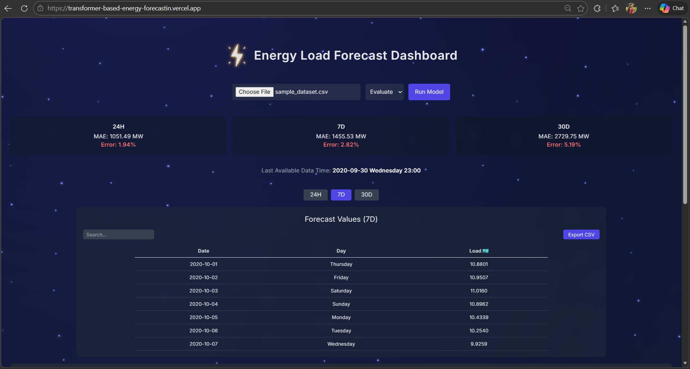
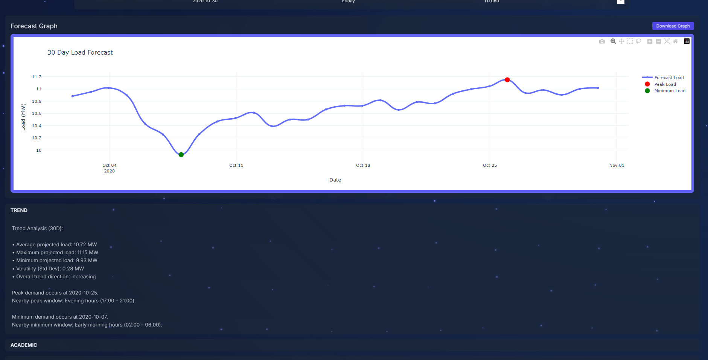
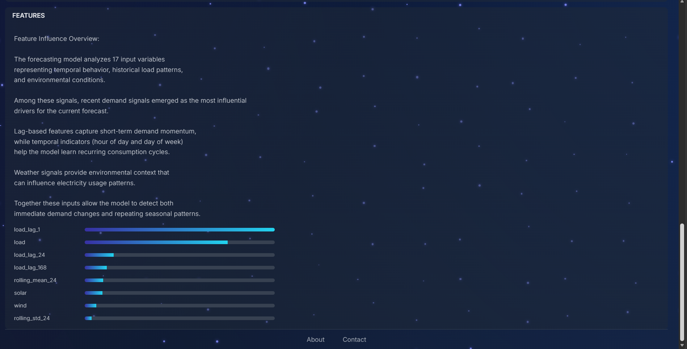

# ⚡ Transformer-Based Energy Consumption Forecasting

## 📌 Project Overview
This project focuses on long-term energy consumption forecasting using advanced Transformer-based deep learning models. The objective is to accurately predict future electricity load using historical consumption data, weather features, and time-based variables.

The system compares traditional statistical models with modern Transformer architectures to improve forecasting accuracy, scalability, and interpretability.

---

## 🌐 Live Application

### 🖥️ Frontend Dashboard
Interactive AI Energy Forecasting Dashboard:

🔗 https://transformer-based-energy-forecastin.vercel.app/

The dashboard allows users to:

- Upload energy datasets
- Run forecasting models
- Visualize prediction results
- Explore forecast graphs and model outputs

---

### ⚙️ Backend API
FastAPI service powering the forecasting engine:

🔗 https://energy-forecast-api-sfrz.onrender.com

The backend handles:

- Dataset processing
- Data validation and preprocessing
- Model inference
- Forecast generation
- Returning prediction results to the frontend

---

## 🎯 Objectives

- Forecast multi-step future energy load
- Capture long-term dependencies in time-series data
- Compare baseline models with advanced Transformer models
- Improve long-horizon prediction accuracy
- Provide interpretable forecasting results

---

## 🧠 Models Implemented

### 🔹 Baseline Models
- ARIMA
- SARIMA
- LSTM
- DeepAR
- MQRNN

### 🔹 Transformer-Based Models
- Temporal Fusion Transformer (TFT)
- Informer

---

## 📊 Dataset

The dataset includes:

- Electricity Load
- Solar Generation
- Wind Generation
- Wind Onshore / Offshore
- Hour
- Day of Week
- Month
- Holiday Indicators
- Lag Features

Data preprocessing includes:

- Normalization
- Feature scaling
- Lag feature generation
- Time-based feature engineering

---

# 🏗 System Architecture
```
               User
                │
                ▼
        React Frontend (Vercel)
                │
                ▼
        FastAPI Backend (Render)
                │
                ▼
    Transformer Forecasting Model
                │
                ▼
    Prediction Results + Forecast Graphs
                │
                ▼
     Interactive Dashboard Visualization
```


## 📁 Project Structure

```
energy_forecasting/
│
├── config.py                   # Global configuration settings
├── main.py                     # Main execution pipeline
|
├── backend/                      # FastAPI backend service
│   ├── api.py                    # Main API endpoint
│   ├── static/                   # Generated forecast graphs
│   └── requirements.txt          # Backend dependencies
|
├── frontend/                     # React forecasting dashboard
│   ├── public/
│   ├── src/
│   │   ├── components/           # UI components
│   │   ├── About.jsx
│   │   ├── Contact.jsx
│   │   ├── Dashboard.jsx         # Main dashboard interface
│   │   ├── App.jsx
│   │   ├── main.jsx
│   │   └── index.css
│   │
│   ├── index.html
│   ├── package.json
│   └── tailwind.config.js
|
├── data/
│   └── processed/
│       └── final_energy_forecasting_dataset.csv
│
├── evaluation/
│   └── evaluate_multiscale.py  # MAE, RMSE, coverage metrics
│
├── explainability/
│   ├── explain_academic.py
│   ├── explain_attention_academic.py
│   └── explain_features.py
│
├── interface/
│   └── forecast_interface.py   # Interactive forecast system
│
├── models/
│   └── hybrid_multitask.py     # Transformer-based forecasting model
│
├── preprocessing/
│   └── dataset_multitask.py    # Dataset preparation & sliding window
│
├── production/
│   └── daily_forecast.py       # Real-time deployment script
│
├── results/
│   ├── models/                 # Saved model weights
│   ├── plots/                  # Forecast visualizations
│   └── reports/                # Generated summaries
│
└── training/
    └── train.py                # Model training (50 epochs)


```

---

# ⚙️ Backend (FastAPI)

The backend service is built using **FastAPI** and handles communication between the dashboard and forecasting models.

### Backend Responsibilities

- Accept dataset uploads
- Perform preprocessing and validation
- Run trained forecasting models
- Generate predictions
- Create forecast visualization graphs
- Return results to the frontend

### Run Backend Locally

```bash
cd backend
pip install -r requirements.txt
uvicorn api:app --reload
```
---
### Backend runs at (Locally):
```
http://127.0.0.1:8000
```

---

### 🎨 Frontend (React Dashboard)

The frontend dashboard is built with React and TailwindCSS to provide an intuitive interface for interacting with the forecasting system.

Features

- Dataset upload interface

- Forecast configuration options

- Interactive prediction visualization

- Forecast graph display

- Modern responsive UI

### Run Frontend Locally

```
cd frontend
npm install
npm run dev
```
### Frontend runs at:
```
http://localhost:5173
```


---

## 📈 Evaluation Metrics

- MAE (Mean Absolute Error)
- RMSE (Root Mean Squared Error)
- MSE (Mean Squared Error)
- Quantile Loss (for probabilistic forecasting)

---

## 🛠️ Technologies Used

### Machine Learning

- Python

- PyTorch

- NumPy

- Pandas

- Scikit-learn

 ### Visualization

- Matplotlib

- Plotly

### Backend

- FastAPI

- Uvicorn

### Frontend

- React

- TailwindCSS

- Axios

### Deployment

- Vercel (Frontend Hosting)

- Render (Backend API)

---

## 🚀 How to Run
### 1️⃣ Clone the Repository
```
git clone https://github.com/tsudheer1480/Transformer-Based-Energy-Forecasting.git
cd energy-forecasting
```

### 2️⃣ Create Virtual Environment
```
python -m venv energy_env
energy_env\Scripts\activate   # Windows
```

### 3️⃣ Install Dependencies
```
pip install -r requirements.txt
```

### 4️⃣ Train the Model
```
python main.py
```

### 5️⃣ Evaluate the Model
```
python evaluate.py
```

---

## 📊 Results

Transformer-based models (TFT and Informer) outperform traditional LSTM and ARIMA models in:

- Long-horizon forecasting
- Capturing seasonal patterns
- Handling multiple input features
- Providing interpretable outputs

---

## 🔍 Key Contributions

- Implementation of Temporal Fusion Transformer (TFT)
- Implementation of Informer for long-sequence forecasting
- Advanced feature engineering with lag variables
- Multi-horizon probabilistic forecasting
- Comparative analysis of classical vs deep learning models

---
## 📊 Project Outputs

### Dashboard Interface

<p align="center">
  
</p>

---

### Energy Forecast Visualization

<p align="center">
  
</p>

---

### Model Prediction Results

<p align="center">
  
</p>


## 👨‍💻 Author

Sudheer Tantapureddy  
B.Tech – SRKR Engineering College  
Data Science & Machine Learning Enthusiast  

---

## 📜 License

This project is developed for academic and research purposes.
